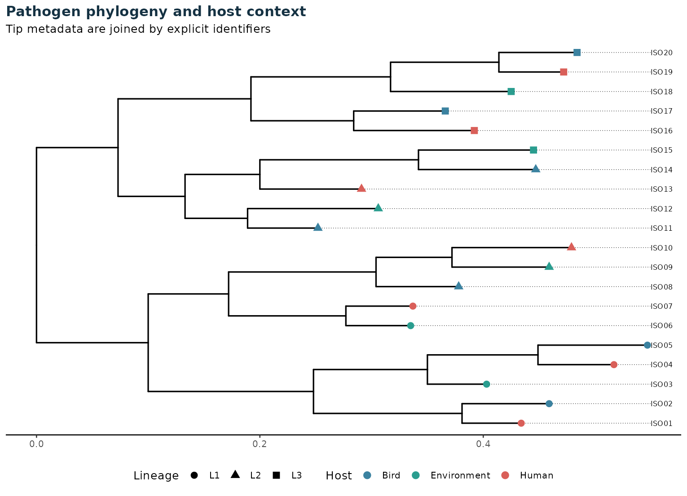
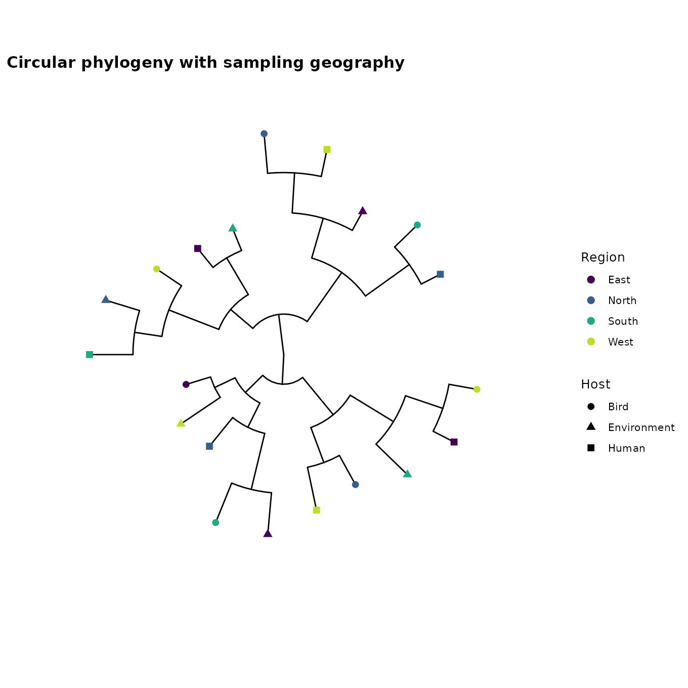
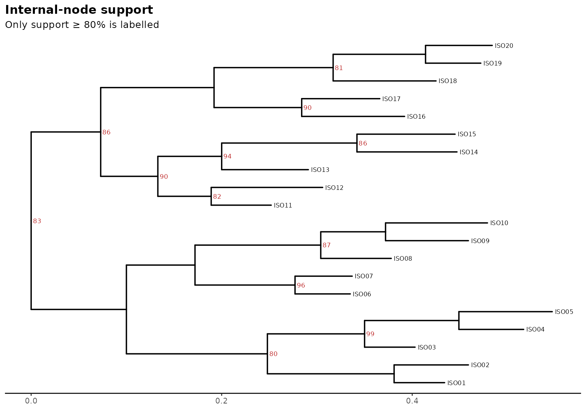
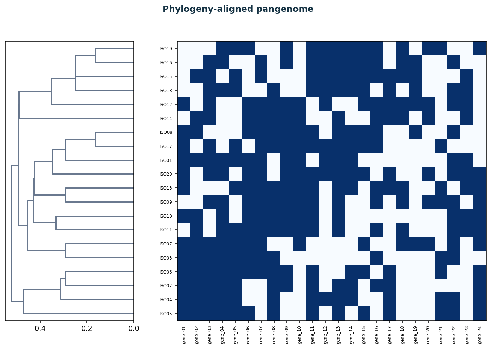
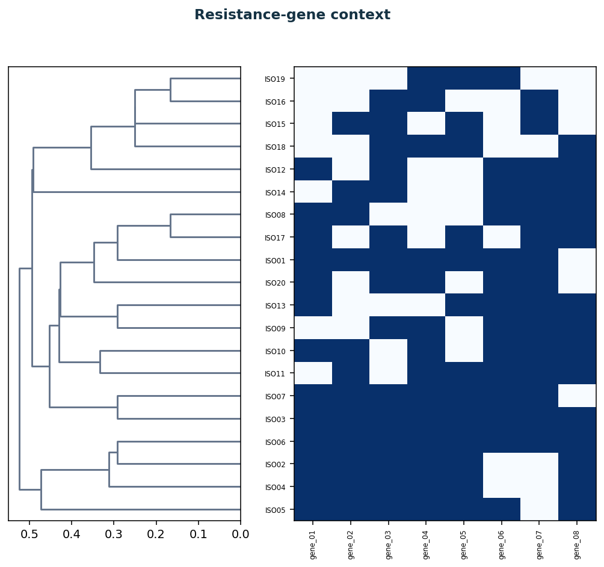
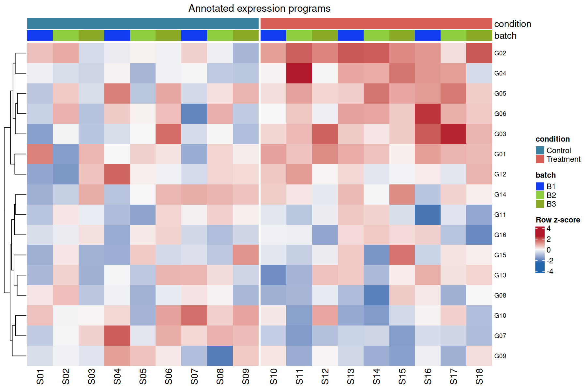
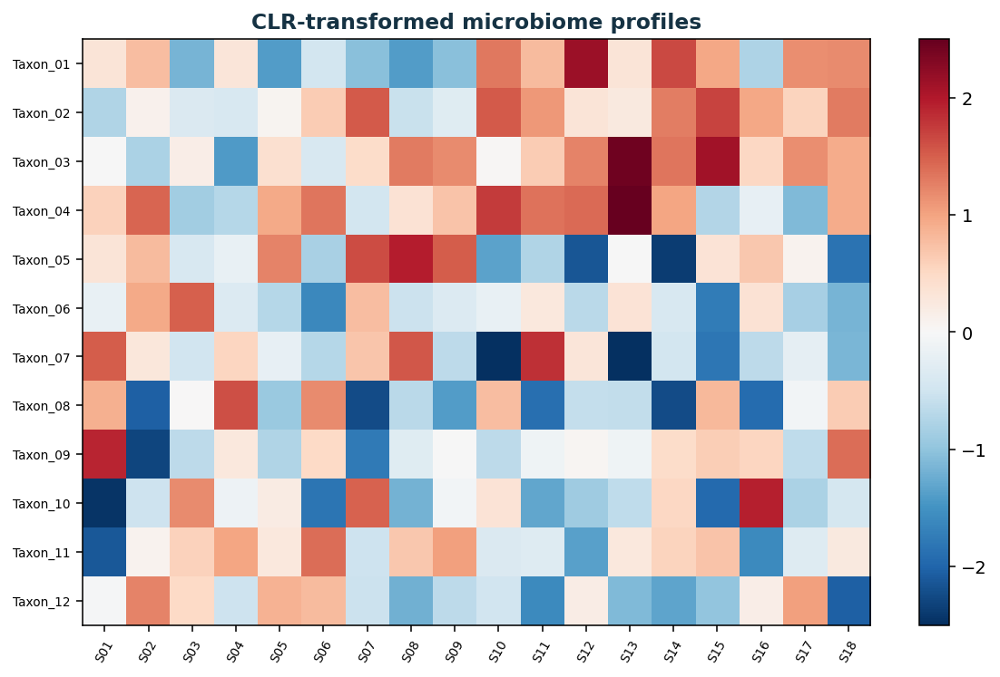
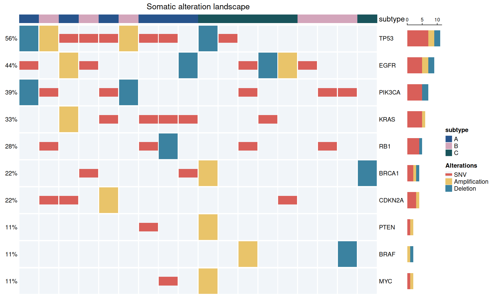
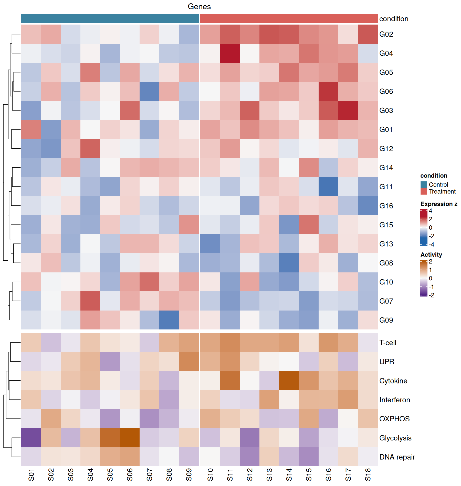
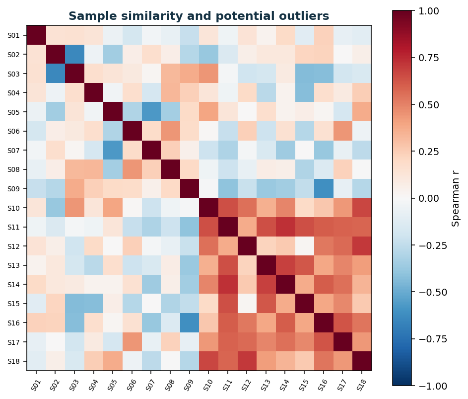

# Tree-Aligned Phylogenomics with ggtree + ComplexHeatmap

[](https://github.com/mbilal-OU/ggtree-complexheatmap-phylogenomics/actions/workflows/ci.yml)
[](https://github.com/mbilal-OU/ggtree-complexheatmap-phylogenomics/actions/workflows/gallery.yml)
[](https://bioconductor.org/)
[](LICENSE.md)

A **tutorial-first, tested portfolio for tree-aligned genomic visualization**.
Its distinctive role is coordination: ggtree maps phylogenetic structure and
associated data, while ComplexHeatmap composes ordered matrices, annotation
tracks, heatmap lists, oncoprints, and legends. Identifier validation preserves
alignment from input through export.

All data are deterministic simulations for learning and testing, not biological
evidence.

## Start here

| Goal | Resource |
|---|---|
| Learn tree annotation and layouts | [`01_ggtree_foundations.Rmd`](tutorials/01_ggtree_foundations.Rmd) |
| Learn annotated and multi-panel heatmaps | [`02_complexheatmap_workflows.Rmd`](tutorials/02_complexheatmap_workflows.Rmd) |
| Reuse validated functions | [`R/trees.R`](R/trees.R) and [`R/heatmaps.R`](R/heatmaps.R) |
| Understand alignment safeguards | [`R/validation.R`](R/validation.R) |
| Review scientific limits | [`docs/scientific-practice.md`](docs/scientific-practice.md) |
| Browse rendered reference | [Documentation](https://mbilal-ou.github.io/ggtree-complexheatmap-phylogenomics/) |

## Visual tutorial gallery

The Gallery workflow regenerates every panel using the current Bioconductor
release. Click any title or figure for its data contract, exact R function,
own-data workflow, interpretation, and scientific limits.

| Phylogenomic analysis | Phylogenomic analysis |
|---|---|
| [**1 · Host-annotated phylogeny**](docs/figure-tutorials.md#01-host-annotated-phylogeny)<br>[](docs/figure-tutorials.md#01-host-annotated-phylogeny)<br>Tip metadata join through validated identifiers. | [**2 · Circular geographic overview**](docs/figure-tutorials.md#02-circular-geographic-overview)<br>[](docs/figure-tutorials.md#02-circular-geographic-overview)<br>Layout changes without changing topology or metadata meaning. |
| [**3 · Internal-node support**](docs/figure-tutorials.md#03-internal-node-support)<br>[](docs/figure-tutorials.md#03-internal-node-support)<br>Only support above a declared threshold is labelled. | [**4 · Tree-aligned pangenome**](docs/figure-tutorials.md#04-tree-aligned-pangenome)<br>[](docs/figure-tutorials.md#04-tree-aligned-pangenome)<br>Matrix rows are reordered to tree-tip order before rendering. |
| [**5 · Resistance-gene context**](docs/figure-tutorials.md#05-resistance-gene-context)<br>[](docs/figure-tutorials.md#05-resistance-gene-context)<br>A focused binary gene panel stays aligned to evolutionary history. | [**6 · Annotated expression programs**](docs/figure-tutorials.md#06-annotated-expression-programs)<br>[](docs/figure-tutorials.md#06-annotated-expression-programs)<br>Condition, batch, splits, clustering, and row z-scores are explicit. |
| [**7 · CLR microbiome profiles**](docs/figure-tutorials.md#07-clr-microbiome-profiles)<br>[](docs/figure-tutorials.md#07-clr-microbiome-profiles)<br>Compositional coordinates replace raw-count colour mapping. | [**8 · Somatic alteration oncoprint**](docs/figure-tutorials.md#08-somatic-alteration-oncoprint)<br>[](docs/figure-tutorials.md#08-somatic-alteration-oncoprint)<br>SNVs, amplifications, deletions, subtype, and alteration burden coexist. |
| [**9 · Integrated multi-omics heatmap**](docs/figure-tutorials.md#09-integrated-multi-omics-heatmap)<br>[](docs/figure-tutorials.md#09-integrated-multi-omics-heatmap)<br>Expression and pathway activity share the same ordered samples. | [**10 · Sample similarity**](docs/figure-tutorials.md#10-sample-similarity)<br>[](docs/figure-tutorials.md#10-sample-similarity)<br>Clustered Spearman correlation supports batch and outlier review. |

## What this repository proves

| Skill | Evidence |
|---|---|
| ggtree grammar | Rectangular/circular layouts, tip annotations, node labels, aligned heatmaps |
| ComplexHeatmap engineering | Annotation tracks, splits, clustering, oncoprints, heatmap lists, legends |
| Phylogenomic alignment | Strict identifier checks and explicit row reordering |
| Omics transformations | Binary presence/absence, row z-scores, CLR coordinates, Spearman similarity |
| Reusable R design | Package API, namespaced dependencies, deterministic builders, documented failures |
| Reliability | testthat, R CMD check, coverage, and gallery regeneration on Bioconductor release |

## Quick start

```r
if (!requireNamespace("BiocManager", quietly = TRUE)) install.packages("BiocManager")
if (!requireNamespace("remotes", quietly = TRUE)) install.packages("remotes")
if (!requireNamespace("ape", quietly = TRUE)) install.packages("ape")

BiocManager::install(c("ggtree", "ComplexHeatmap"))
remotes::install_github("mbilal-OU/ggtree-complexheatmap-phylogenomics")

library(phyloheatmapviz)
tree <- ape::read.tree("data/pathogen_tree.nwk")
metadata <- read.csv("data/tip_metadata.csv")
rectangular_phylogeny(tree, metadata)
```

## Scientific guardrails

- A tree layout is not a tree inference method; topology and branch lengths come from upstream analysis.
- Tip metadata must be joined by identifiers, never by incidental row order.
- Bootstrap or posterior support is not the probability that a biological narrative is true.
- Presence/absence matrices require a defined gene-calling and clustering workflow.
- Heatmap clustering depends on transformation, distance, linkage, filtering, and missing-data choices.
- Row z-scores support within-feature comparisons but remove absolute between-feature scale.
- CLR coordinates require documented zero handling and cannot be interpreted as proportions.
- Oncoprints summarize calls; they do not validate variant quality or clinical significance.

## Visualization portfolio series

- [Seaborn](https://github.com/mbilal-OU/seaborn-biological-statistics) · [Matplotlib](https://github.com/mbilal-OU/matplotlib-genomic-figures) · [Plotly](https://github.com/mbilal-OU/plotly-interactive-omics)
- [ggplot2](https://github.com/mbilal-OU/ggplot2-omics-grammar) · **ggtree + ComplexHeatmap** · [Shiny](https://github.com/mbilal-OU/shiny-omics-explorer) · [Gnuplot](https://github.com/mbilal-OU/gnuplot-bioinformatics-cli)

Citation metadata are in [`CITATION.cff`](CITATION.cff). Code is under the [MIT License](LICENSE.md).
